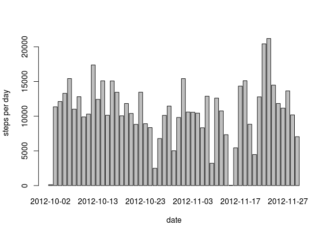
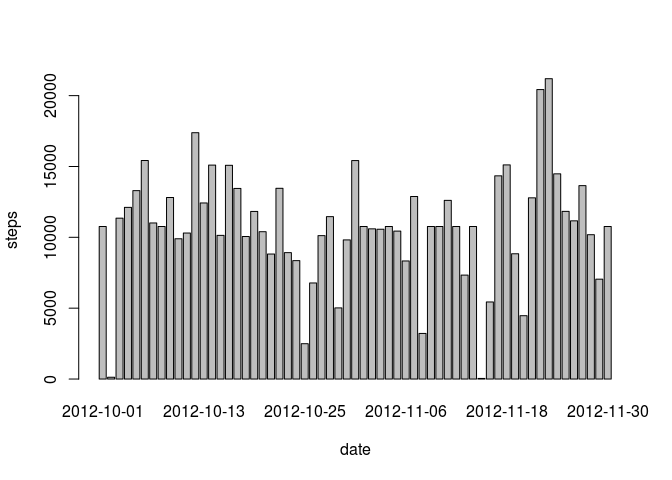
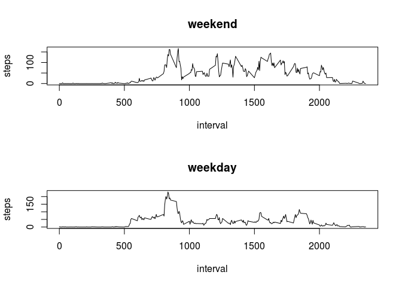

# Reproducible Research: Peer Assessment 1


## Loading and preprocessing the data


```r
#Load the data  
df <- read.csv("activity.csv")
# format the date which is necessary for analysis
df$date <- as.Date(df$date)
#check the output and the data types
str(df)
```

```
## 'data.frame':	17568 obs. of  3 variables:
##  $ steps   : int  NA NA NA NA NA NA NA NA NA NA ...
##  $ date    : Date, format: "2012-10-01" "2012-10-01" ...
##  $ interval: int  0 5 10 15 20 25 30 35 40 45 ...
```

## What is mean total number of steps taken per day?
As the assignment states, calculate the mean & median of steps per day ignoring NA values i.e. na.rm = true.
Draw a histogram


```r
steps.date <- aggregate(steps ~ date, data = df, FUN = sum, na.rm = TRUE)
barplot(steps.date$steps, names.arg = steps.date$date, xlab = "date", ylab = "steps per day")
```

 

Calculate the mean & median
1. Mean

```r
mean(steps.date$steps)
```

```
## [1] 10766.19
```

2.Median

```r
median(steps.date$steps)
```

```
## [1] 10765
```

## What is the average daily activity pattern?

1. Make a time series plot (i.e. type = "l")  of the 5-minute interval (x-axis) and the average number of steps taken, averaged across all days (y-axis)


```r
steps.interval <- aggregate(steps ~ interval, data = df, FUN = mean)
plot(steps.interval, type = "l")
```

 

2. Which 5-minute interval, on average across all the days in the dataset, contains the maximum number of steps?


```r
steps.interval$interval[which.max(steps.interval$steps)]
```

```
## [1] 835
```

## Imputing missing values

1. Calculate and report the total number of missing values in the dataset (i.e. the total number of rows with NAs)


```r
sum(is.na(df))
```

```
## [1] 2304
```

2. Devise a strategy for filling in all of the missing values in the dataset. The strategy does not need to be sophisticated. For example, you could use the mean/median for that day, or the mean for that 5-minute interval, etc.

3. Create a new dataset with filling the missing values. Will use the means of 5 min intervals to fill missing
values.


```r
activity <- merge(df, steps.interval, by = "interval", suffixes = c("", ".y"))
nas <- is.na(activity$steps)
activity$steps[nas] <- activity$steps.y[nas]
activity <- activity[, c(1:3)]
```

4. Make a histogram of the total number of steps taken each day and Calculate and report the mean and median total number of steps taken per day. Do these values differ from the estimates from the first part of the assignment? What is the impact of imputing missing data on the estimates of the total daily number of steps?


```r
steps.date <- aggregate(steps ~ date, data = activity, FUN = sum)
barplot(steps.date$steps, names.arg = steps.date$date, xlab = "date", ylab = "steps")
```

 

Calculate the mean & median

Mean

```r
mean(steps.date$steps)
```

```
## [1] 10766.19
```

Median

```r
median(steps.date$steps)
```

```
## [1] 10766.19
```

As you see, the mean remains the same but the median is a tad up with the na's being filled in by means of 5 minute intervals

## Are there differences in activity patterns between weekdays and weekends?

For this part the weekdays() function may be of some help here. Use the dataset with the filled-in missing values for this part.

1. Create a new factor variable in the dataset with two levels – “weekday” and “weekend” indicating whether a given date is a weekday or weekend day.

Using the new dataset without the missing values


```r
daytype <- function(date) {
    if (weekdays(as.Date(date)) %in% c("Saturday", "Sunday")) {
        "weekend"
    } else {
        "weekday"
    }
}
activity$daytype <- as.factor(sapply(activity$date, daytype))
```

2. Make a panel plot containing a time series plot (i.e. type = "l") of the 5-minute interval (x-axis) and the average number of steps taken, averaged across all weekday days or weekend days (y-axis).


```r
par(mfrow = c(2, 1))
for (type in c("weekend", "weekday")) {
    steps.type <- aggregate(steps ~ interval, data = activity, subset = activity$daytype == 
        type, FUN = mean)
    plot(steps.type, type = "l", main = type)
}
```

 
